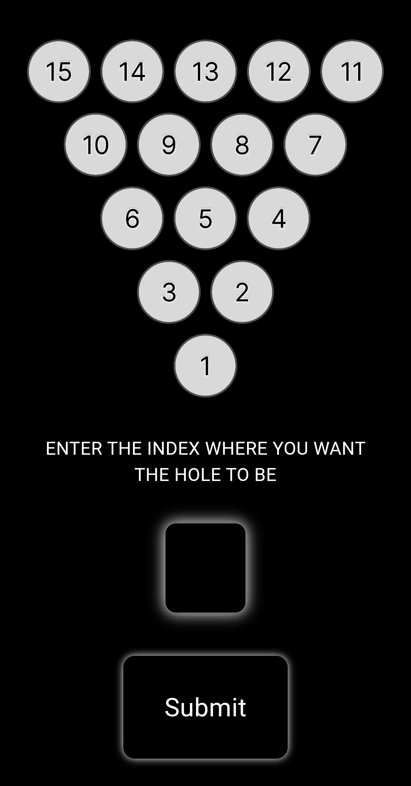
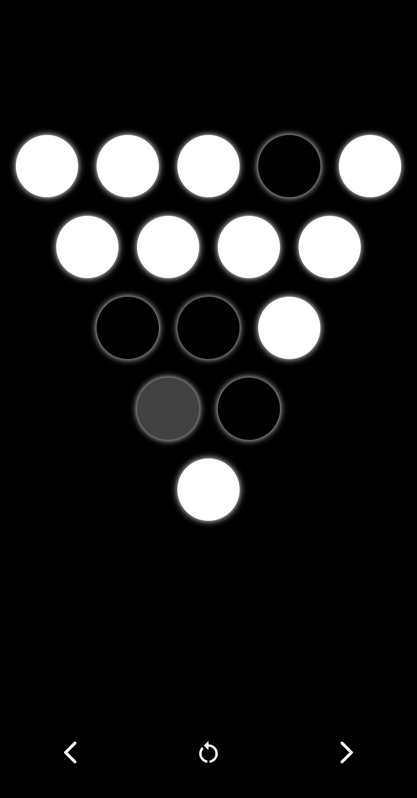
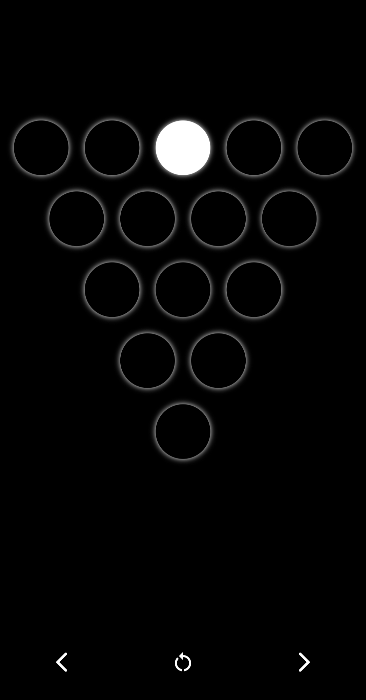

# Leap Logic

A Flutter application that provides an interactive solution to the <u>15 Peg Problem</u>, also known as the Peg Solitaire game. The objective is to jump pegs over each other into empty spaces, removing the jumped pegs, until only one peg remains.

## Table of Contents

- [Description](#description)
- [Features](#features)
- [Getting Started](#getting-started)
  - [Prerequisites](#prerequisites)
  - [Installation](#installation)
- [Usage](#usage)
- [Screenshots](#screenshots)
- [Contributing](#contributing)
- [License](#license)
- [Contact](#contact)

## Description

This project is a Flutter application designed to solve the 15 Peg Problem. It includes an interactive board where users can play the game by themselves or let the app solve the puzzle step by step.

## Features

- Step-by-step solution to the 15 Peg Problem.
- Visual representation of moves.
- Reset and undo functionality.

## Getting Started

### Prerequisites

- Flutter SDK: [Install Flutter](https://flutter.dev/docs/get-started/install)
- Dart SDK: Included with Flutter
- An IDE such as Visual Studio Code or Android Studio

### Installation

1. Clone the repository:

    ```bash
    git clone https://github.com/CrayFish0/leap-logic.git
    ```

2. Navigate to the project directory:

    ```bash
    cd 15-peg-problem-solver
    ```

3. Install dependencies:

    ```bash
    flutter pub get
    ```

4. Run the application:

    ```bash
    flutter run
    ```

## Usage

1. Open the app on your emulator or physical device.
2. Watch the app solve the puzzle.

## Screenshots





## Contributing

Contributions are welcome! Please follow these steps to contribute:

1. Fork the repository.
2. Create a new branch: `git checkout -b my-feature-branch`.
3. Make your changes and commit them: `git commit -m 'Add some feature'`.
4. Push to the branch: `git push origin my-feature-branch`.
5. Create a pull request.

## License

This project is licensed under the MIT License - see the [LICENSE](LICENSE) file for details.

## Contact

- **Your Name** - [cray.fish.75.02@gmail.com](mailto:cray.fish.75.02@gmail.com)
- GitHub: [Cray Fish](https://github.com/CrayFish0)
